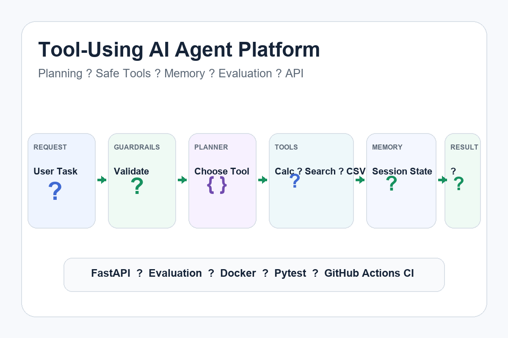

# Tool-Using AI Agent Workflow Platform

Portfolio-grade AI agent project demonstrating **planning, tool use, memory, guardrails, evaluation, API delivery, testing, and CI**.

## What it demonstrates

- deterministic agent planning for reliable evaluation
- safe arithmetic tool
- local knowledge-search tool
- CSV inspection tool
- session memory
- request guardrails
- tool-selection evaluation
- FastAPI endpoint
- Docker-ready delivery
- automated pytest coverage
- GitHub Actions CI

The architecture is deliberately provider-neutral. The deterministic planner makes local tests reproducible, while the same tool and memory layer can be connected to an LLM provider in production.

## Architecture

User request
-> Guardrails
-> Planner
-> Tool router
-> Calculator / Knowledge Search / CSV Summary
-> Result
-> Session Memory
-> Evaluation
-> FastAPI
-> Docker / CI

## Example requests

~~~text
calculate: 12 * 4 + 2
search: express shipping
summarize csv: C:\path\to\data.csv
~~~

## Run locally

~~~bash
python -m pip install -r requirements.txt
uvicorn app.api:app --reload
~~~

## Run tests

~~~bash
pytest -q
~~~

## Why this matters for client work

Real AI-agent projects need more than a chat prompt. They need:
- clear tool boundaries
- memory
- safe execution
- observable routing decisions
- evaluation
- APIs
- tests
- a deployment path

This repository demonstrates those engineering foundations without requiring a paid LLM key for the local demo and CI path.

## Production extensions

- OpenAI/Anthropic/Gemini planner adapters
- structured function calling
- retrieval/RAG tool
- browser or SaaS integrations
- persistent memory
- background jobs
- human approval checkpoints
- tracing and cost/latency metrics
